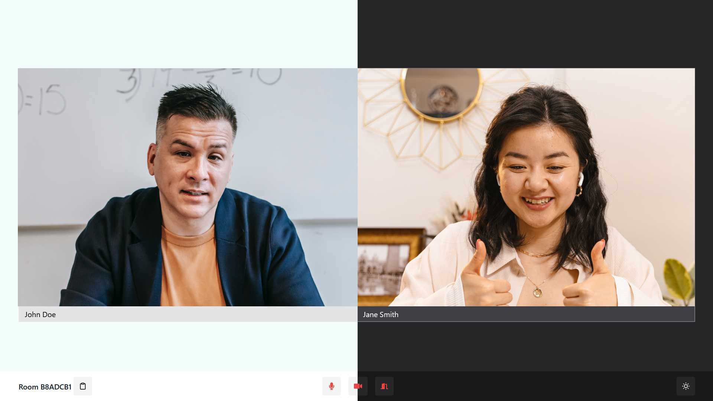

<!-- PROJECT LOGO -->
<div align="center">
  <h1 align="center">Video Chat App</h3>
  
</div>

<!-- ABOUT THE PROJECT -->

## About This Project

A web application to connect online with others via video chat, using WebSocket and WebRTC protocols. View live demo at <a href="https://garyjx-video-chat.vercel.app/" target="_blank">garyjx-video-chat.vercel.app</a>

#### Built With

- TypeScript
- React
- Next.js
- WebRTC
- Tailwind CSS
- Socket.IO

<!-- GETTING STARTED -->

## Getting Started

#### Installation and Set Up

1. Clone the repository.
   ```sh
   git clone https://github.com/GaryJX/video-chat-app.git
   ```
2. `cd` into the project root directory.
   ```sh
   cd video-chat-app
   ```
3. Install dependencies.
   ```sh
   npm install
   ```
4. Create `.env.local` by copying the template file `.env.sample`.
   ```sh
   cp .env.sample .env.local
   ```
5. Update `.env.local` with your API key.

   ```
   # .env.local

   IP_API_KEY=<YOUR_API_KEY>
   ```

6. Start the development server.
   ```sh
   npm run dev
   ```
7. Open the application at http://localhost:3000/

#### Production Deployment

- The `client` folder containing the front-end code is hosted on [Vercel](vercel.com), and is automatically rebuilt whenever a commit is pushed to the `main` branch
- The `server` folder containing the server-side code is hosted on [Heroku](https://heroku.com/). To trigger a re-deployment, push the changes to Heroku's remote Git repository:
  ```sh
  git subtree push --prefix server heroku main
  ```
